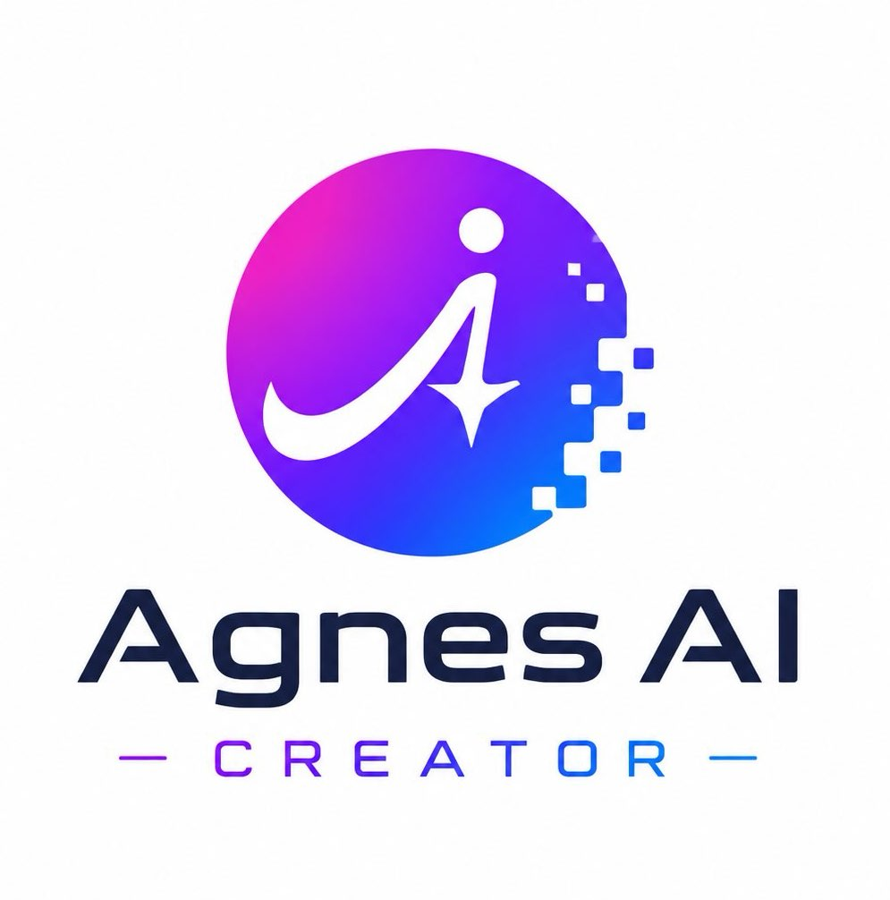

<h4 align="right"><a href="README_EN.md">English</a> | <strong>简体中文</strong></h4>
<p align="center">
  
</p>
<h1 align="center">Agnes AI Creator</h1>
<p align="center"><strong>基于 Agnes AI 免费大模型的自托管多模态 Web 客户端</strong></p>
<p align="center">AI 对话 · 文生图 / 图生图 · 文生视频 / 图生视频 · 七牛云持久化（可选）</p>
<div align="center">
  <a href="./LICENSE" target="_blank">
  </a>
  <a href="https://platform.agnes-ai.com/" target="_blank">
  </a>
  <a href="https://agnes-ai.com/doc/overview" target="_blank">
  </a>
  <a href="https://www.python.org/" target="_blank">
  </a>
  <a href="https://vuejs.org/" target="_blank">
  </a>
  <a href="https://fastapi.tiangolo.com/" target="_blank">
  </a>
  <a href="https://vitejs.dev/" target="_blank">
  </a>
  <a href="https://x.com/haiqushe" target="_blank">
  </a>
  <a href="https://dz.haiqushe.com/" target="_blank">
  </a>
</div>

> 免费使用 Agnes AI 模型，自己去 [Agnes AI 平台官网](https://platform.agnes-ai.com/) 注册后填入 key 即可使用。

> 推荐一个汇聚全球 500+ 大模型的 AI 大模型中转站: [AIGC1024.com](https://aigc1024.com/)

<p align="center">
  
</p>

<p align="center">
  <strong>对话 · 生图 · 生视频 · 一个界面全搞定</strong><br/>
  免费 Agnes AI 模型 &nbsp;·&nbsp; Vue 3 + FastAPI 全栈 &nbsp;·&nbsp; 毛玻璃现代 UI &nbsp;·&nbsp; 网页可视化配置
</p>

## 界面预览

<table cellpadding="6">
  <tr>
    <td width="50%" align="center" valign="top">
      
      <strong>🎨 图片生成</strong><br/>
      <span style="font-size:13px">文生图 · 单图编辑 · 多图合成 · 历史回看</span>
    </td>
    <td width="50%" align="center" valign="top">
      
      <strong>🎬 视频生成</strong><br/>
      <span style="font-size:13px">文/图生视频 · 关键帧动画 · 内置播放器 · 七牛云转存</span>
    </td>
  </tr>
  <tr>
    <td width="50%" align="center" valign="top">
      
      <strong>💬 AI 对话</strong><br/>
      <span style="font-size:13px">流式输出 · Thinking 模式 · Token 统计 · 多对话切换</span>
    </td>
    <td width="50%" align="center" valign="top">
      
      <strong>⚙️ 网页设置</strong><br/>
      <span style="font-size:13px">API Key / Base URL 可视化配置 · 多 Key 管理 · 即改即用</span>
    </td>
  </tr>
</table>

## 功能特性

| 模块 | 能力 |
|------|------|
| **文本对话** | 新建 / 切换对话、流式输出、Thinking 模式、Token 与耗时统计 |
| **图片生成** | 文生图、单图编辑、多图合成；多模型支持 |
| **视频生成** | 文生视频、图生视频、多图视频、关键帧动画；后台异步轮询任务状态 |
| **媒体存储** | 图片 / 视频生成结果自动转存七牛云，持久化历史记录 |
| **网页设置** | 可视化配置 API Base URL、多 Key 管理与切换，无需改代码或重启 |

### 支持的模型

| 类型 | 模型 |
|------|------|
| 文本 | `agnes-2.0-flash`、`agnes-1.5-flash`（已弃用） |
| 图片 | `agnes-image-2.0-flash`、`agnes-image-2.1-flash` |
| 视频 | `agnes-video-v2.0` |

## 技术栈

- **前端**: Vue 3 · Vite · Vue Router · Tailwind CSS
- **后端**: Python 3 · FastAPI · httpx · APScheduler
- **数据库**: SQLite（零配置，首次启动自动建表，SQL 文件在 backend/sql 文件夹里）
- **对象存储**: 七牛云（可选）
- **AI 接口**: [Agnes AI OpenAI 兼容 API](https://agnes-ai.com/doc/overview)

## 环境要求

- Python 3.10+
- Node.js 18+
- [Agnes AI API Key](https://platform.agnes-ai.com/)（免费申请，在网页 **设置** 中配置）
- 七牛云对象存储（可选，用于持久化保存生成结果）

## 快速开始

### 1. 克隆项目

```bash
git clone https://github.com/jiyiren/agnes-ai-creator.git
cd agnes-ai-creator
```

### 2. 配置后端环境变量（可选）

七牛云与数据库路径通过 `backend/.env` 配置；**Agnes AI 的 API Key 与 Base URL 在网页设置中管理**，无需写入 `.env`。

```bash
cp backend/.env.example backend/.env
```

编辑 `backend/.env`：

| 变量 | 必填 | 说明 |
|------|------|------|
| `QINIU_ACCESS_KEY` | 否 | 七牛云 Access Key |
| `QINIU_SECRET_KEY` | 否 | 七牛云 Secret Key |
| `QINIU_BUCKET` | 否 | 存储桶名称 |
| `QINIU_DOMAIN` | 否 | CDN 访问域名，如 `https://xxx.example.com` |
| `QINIU_REGION` | 否 | 存储区域，默认华东 `z0` |
| `DATABASE_PATH` | 否 | SQLite 路径，默认 `./database/aimodel.db` |

> 未配置七牛云时，AI 生成功能仍可用，但媒体可能不会持久化到对象存储。

### 3. 启动后端

建议使用虚拟环境，避免与系统 Python 包冲突：

```bash
cd backend
python3 -m venv .venv
source .venv/bin/activate   # Windows: .venv\Scripts\activate
pip install -r requirements.txt
uvicorn app.main:app --reload --host 0.0.0.0 --port 8000
```

### 4. 启动前端

```bash
cd frontend
npm install
npm run dev
```

### 5. 首次使用：配置 Agnes AI

浏览器访问 [http://localhost:5173](http://localhost:5173)，进入侧边栏 **设置** 页面：

<p align="left">
  
</p>

1. **API Base URL**：默认为 `https://apihub.agnes-ai.com`，一般无需修改
2. **添加 API Key**：填写名称与 Key，勾选「添加后立即启用」
3. 可添加多个 Key，随时切换「使用中」的 Key

配置完成后即可使用对话、图片、视频功能。

前端开发服务器会将 `/api` 请求代理至 `http://127.0.0.1:8000`。

## 生产部署

```bash
# 构建前端静态资源
cd frontend && npm run build

# 后端以生产模式运行（建议在 venv 中）
cd backend
source .venv/bin/activate
uvicorn app.main:app --host 0.0.0.0 --port 8000
```

将 `frontend/dist` 交由 Nginx 等静态服务器托管，并将 `/api` 反向代理到 FastAPI 服务即可。

## API 文档

后端启动后访问 [http://localhost:8000/docs](http://localhost:8000/docs) 查看 Swagger 文档。

### 设置相关接口

| 方法 | 路径 | 说明 |
|------|------|------|
| GET | `/api/settings/status` | 配置状态（是否有启用 Key、Base URL 等） |
| GET | `/api/settings/base-url` | 获取 API Base URL |
| PUT | `/api/settings/base-url` | 更新 API Base URL |
| GET | `/api/settings/api-keys` | 列出所有 API Key（脱敏） |
| POST | `/api/settings/api-keys` | 添加 API Key |
| PATCH | `/api/settings/api-keys/{id}` | 编辑名称或 Key |
| POST | `/api/settings/api-keys/{id}/activate` | 启用指定 Key |
| DELETE | `/api/settings/api-keys/{id}` | 删除 Key |

## 数据库

- 建表 SQL：`backend/sql/schema.sql`
- 默认数据库文件：`backend/database/aimodel.db`
- 首次启动时自动初始化

主要数据表：

| 表名 | 用途 |
|------|------|
| `conversations` / `messages` | 对话与消息记录 |
| `image_tasks` / `video_tasks` | 图片 / 视频生成任务 |
| `uploads` | 上传文件记录 |
| `api_keys` | Agnes AI API Key 配置 |
| `app_settings` | 应用级配置（如 Base URL） |

## 七牛云存储路径

| 类型 | 路径 |
|------|------|
| 图片 | `data/img/` |
| 视频 | `data/video/` |
| 文档 | `data/document/` |
| 其他 | `data/other/` |

## 项目结构

```
agnes-ai-creator/
├── backend/
│   ├── app/
│   │   ├── main.py              # FastAPI 入口 & 定时任务
│   │   ├── config.py            # 环境变量与模型配置
│   │   ├── database.py          # SQLite 连接与初始化
│   │   ├── schemas.py           # 请求 / 响应模型
│   │   ├── routers/             # chat / images / videos / settings
│   │   └── services/            # Agnes API、Key 管理、七牛云、视频轮询
│   ├── sql/schema.sql           # 数据库建表 SQL
│   ├── database/                # SQLite 数据库文件（gitignore）
│   ├── .env.example             # 环境变量示例
│   └── requirements.txt
├── frontend/
│   └── src/
│       ├── views/               # 对话、图片、视频、设置页面
│       ├── api/                 # API 客户端
│       ├── components/          # 通用 UI 组件
│       └── composables/         # 可复用逻辑
└── _needs/                      # 需求与设计说明
```

## 开源协议

本项目采用 [MIT License](./LICENSE) 开源。

你可以自由使用、修改和分发本项目的代码，但需保留原始版权声明与许可文本。软件按「原样」提供，不提供任何明示或暗示的担保。
